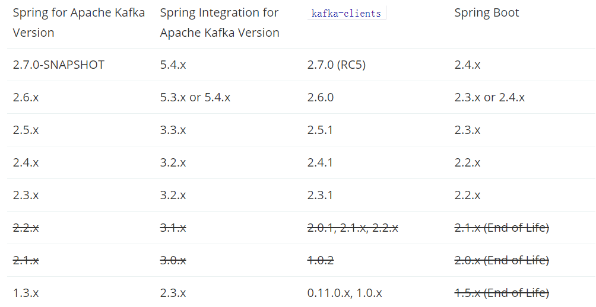

## docker-kafka环境搭建

### 拉取镜像

#### 下载zookeeper

* ```bash
  docker pull wurstmeister/zookeeper
  ```

#### 下载kafka

* ```bash
  docker pull wurstmeister/kafka
  ```

### 启动镜像

#### 启动zookeeper

* ```bash
  docker run -d --name zookeeper -p 2181:2181 -t wurstmeister/zookeeper
  ```

#### 启动kafka

* ```bash
  docker run -d --name kafka -p 9092:9092 -e KAFKA_BROKER_ID=0 -e KAFKA_ZOOKEEPER_CONNECT=192.168.3.200:2181 -e KAFKA_ADVERTISED_LISTENERS=PLAINTEXT://192.168.3.200:9092 -e KAFKA_LISTENERS=PLAINTEXT://0.0.0.0:9092 -t wurstmeister/kafka
  ```

* **其中ip地址需换成宿主机的ip地址**

### 测试kafka

#### 进入kafka容器

* ```bash
  docker exec -it kafka /bin/bash
  ```

#### 进入kafka所在目录

* ```bash
  cd /opt/kafka/
  ```

#### 再开一个xshell客户端，一个作为生产者，一个作为消费者，按上面操作进入kafka目录

#### 发送消息

* ```bash
  ./bin/kafka-console-producer.sh --broker-list localhost:9092 --topic kafka
  ```

#### 接收消息

* ```bash
  ./bin/kafka-console-consumer.sh --bootstrap-server localhost:9092 --topic kafka --from-beginning
  ```

#### 查看topic

* ```bash
  ./bin/kafka-topics.sh --zookeeper 192.168.3.200:2181 --list
  ```

## springboot-kafka简单demo

### pom.xml

* ```xml
  <dependency>
      <groupId>org.springframework.boot</groupId>
      <artifactId>spring-boot-starter-web</artifactId>
  </dependency>
  <!--spring-kafka-->
  <dependency>
      <groupId>org.springframework.kafka</groupId>
      <artifactId>spring-kafka</artifactId>
      <version>2.4.4.RELEASE</version>
  </dependency>
  <dependency>
      <groupId>org.projectlombok</groupId>
      <artifactId>lombok</artifactId>
  </dependency>
  ```

#### 问题记录

* ```java
  org.springframework.beans.factory.BeanCreationException: Error creating bean with name 'org.springframework.boot.autoconfigure.kafka.KafkaAnnotationDrivenConfiguration': Unexpected exception during bean creation; nested exception is java.lang.TypeNotPresentException: Type org.springframework.kafka.listener.RecordInterceptor not present
      at org.springframework.beans.factory.support.AbstractAutowireCapableBeanFactory.createBean(AbstractAutowireCapableBeanFactory.java:544) ~[spring-beans-5.3.2.jar:5.3.2]
      at org.springframework.beans.factory.support.AbstractBeanFactory.lambda$doGetBean$0(AbstractBeanFactory.java:335) ~[spring-beans-5.3.2.jar:5.3.2]
      at org.springframework.beans.factory.support.AbstractBeanFactory$$Lambda$197/106557175.getObject(Unknown Source) ~[na:na]
  ```

* 问题原因：springboot版本与spring-kafka版本不对应，项目中使用的springboot版本是：`2.4.1`，经过测试，spring-kafka的版本需要在`2.4.4.RELEASE`以上，否则会报上面的异常
* springboot版本与spring-kafka版本的对应关系,可以查看[官网](https://spring.io/projects/spring-kafka#overview)
* 下面是官网截图：
* 

### application.yml

* ```yaml
  spring:
    kafka:
      producer:
        bootstrap-servers: 192.168.3.200:9092
      consumer:
        bootstrap-servers: 192.168.3.200:9092
        group-id: 0
  ```

### KafkaController.java

* ```java
  @RestController
  public class KafkaController {
  
      @Resource
      private KafkaProducer kafkaProducer;
  
      @GetMapping("/sendMessage")
      public String sendMessage(String message) {
          kafkaProducer.sendMessage(message);
          return "success";
      }
  }
  ```

### KafkaProducer.java

* ```java
  @Slf4j
  @Component
  public class KafkaProducer {
  
      @Resource
      private KafkaTemplate<String, String> kafkaTemplate;
  
      public void sendMessage(String message) {
          ListenableFuture<SendResult<String, String>> future = kafkaTemplate.send("kafka", message);
          future.addCallback(o -> log.info("kafka-消息发送成功：" + message), throwable -> log.info("kafka-消息发送失败：" + message));
      }
  }
  ```

### KafkaConsumer.java

* ```java
  @Slf4j
  @Component
  public class KafkaConsumer {
  
      @KafkaListener(topics = {"kafka"})
      public void listener(String message){
          log.info("kafka-收到消息："+message);
      }
  }
  ```

* 此时已经可以启动项目，访问：localhost:8080/sendMessage?message=abc 进行测试

### 整合swagger-ui

#### pom.xml

* ```xml
  <!--swagger-ui-->
          <dependency>
              <groupId>io.springfox</groupId>
              <artifactId>springfox-swagger2</artifactId>
              <version>2.9.2</version>
          </dependency>
  		<dependency>
              <groupId>io.springfox</groupId>
              <artifactId>springfox-swagger-ui</artifactId>
              <version>2.9.2</version>
          </dependency>
          <!--增强swagger-ui-->
          <dependency>
              <groupId>com.github.xiaoymin</groupId>
              <artifactId>knife4j-spring-boot-starter</artifactId>
              <version>2.0.4</version>
          </dependency>
  ```

#### Swagger2Config.java

* ```java
  @Configuration
  @EnableSwagger2
  @EnableKnife4j
  public class Swagger2Config {
  
      @Bean
      public Docket createRestApi() {
          return new Docket(DocumentationType.SWAGGER_2)
                  .apiInfo(apiInfo())
                  .select()
                  .apis(RequestHandlerSelectors.basePackage("com.example.kafka"))
                  .paths(PathSelectors.any())
                  .build();
      }
  
      private ApiInfo apiInfo() {
          return new ApiInfoBuilder().title("DEMO--API接口文档")
                  .description("接口返回数据格式为json。其基本结构为{'code': 200, 'msg':'', 'data':{...} }。其中code为错误代码，我们采用"
                          + "标准的http错误代码，比如200代表成功，400代表参数错误，401代表没有登录，500表示服务器内部错误无法完成请求"
                          + "。msg为错误消息，大部分时候为空，当code代码不为200时会是具体的错误描述。data" + "是返回的数据，data的具体内容请参考api。")
                  .termsOfServiceUrl("http://www.xxx.com/")
                  .version("1.0")
                  .build();
      }
  }
  ```

#### 测试地址

* 原生swagger-ui：localhost:8080/swagger-ui.html

* 增强swagger-ui：localhost:8080/doc.html

* 增强swagger-ui界面比原生好看一些（还有一些新增功能，可以百度了解），使用也比较简单，只需引入`knife4j-spring-boot-starter`依赖，在swagger配置类上加`@EnableKnife4j`注解就可以了
