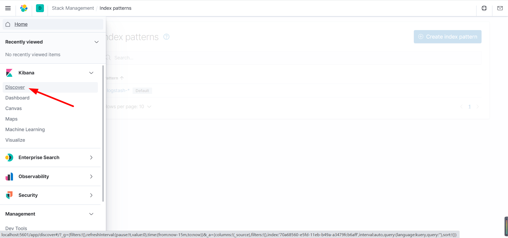
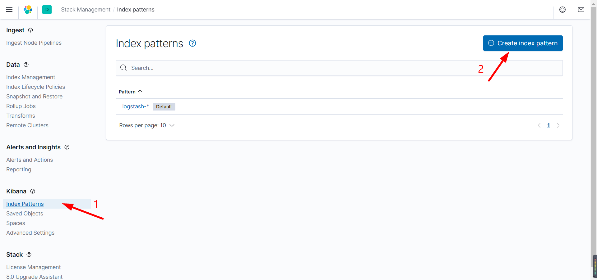
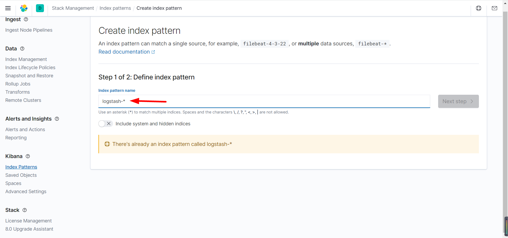
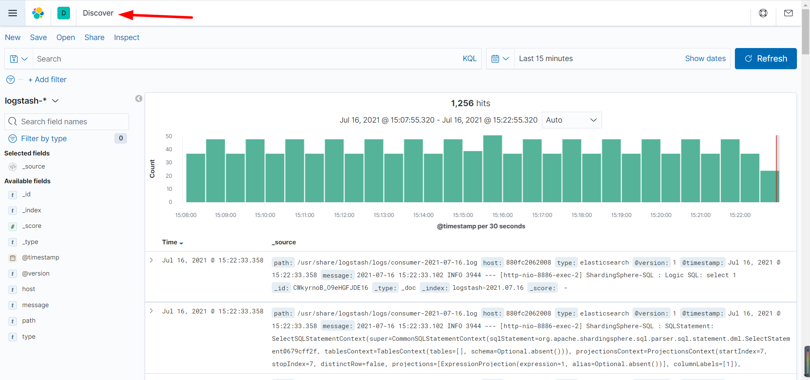

## 安装elasticsearch

* ```bash
  # 拉取镜像
  docker pull elasticsearch:6.8.11
  # 创建单独网络通信（elk + filebeat），这里主要做网络隔离，也可以使用默认网络
  docker network create esnet
  # 启动容器
  docker run -d --name elasticsearch --net esnet -p 9200:9200 -p 9300:9300 -e "discovery.type=single-node" elasticsearch:6.8.11
  ```

## 安装kibana

* ```bash
  # 拉取镜像
  docker pull kibana:6.8.11
  # 启动容器，指定 es 局域网 ip:port
  docker run --name kibana --net esnet -e ELASTICSEARCH_HOSTS=http://172.16.121.132:9200 -p 5601:5601 -d kibana:6.8.11
  ```

## 安装logstash镜像

* ```bash
  # 版本与elasticsearch、kibana保持一致
  docker pull logstash:6.8.11
  ```

## 安装filebeat镜像

* ```bash
  # 版本与elk一致
  docker pull store/elastic/filebeat:6.8.11
  ```

## 创建配置文件

* ```tex
  创建文件夹保存配置文件
  D:\File\ProjectFile\Resource\elk\logstash
  D:\File\ProjectFile\Resource\elk\logstash\config
  D:\File\ProjectFile\Resource\elk\logstash\pipeline
  在config文件夹下创建logstash.yml
  在pipeline文件夹下创建logstash.conf
  ```

* logstash.yml

* ```yaml
  ## Default Logstash configuration from Logstash base image.
  ### https://github.com/elastic/logstash/blob/master/docker/data/logstash/config/logstash-full.yml
  http.host: "0.0.0.0" # 任意主机
  xpack.monitoring.elasticsearch.hosts: [ "http://172.16.121.132:9200" ] 
  # es局域网地址，ip不能写成localhost或127.0.0.1
  # elasticsearch 这里写的是你的ip
  ## X-Pack security credentials
  # xpack.monitoring.enabled: true
  # xpack.monitoring.elasticsearch.username: elastic
  # xpack.monitoring.elasticsearch.password: changeme
  ```

* logstash.conf

* ```json
  input {
    beats {
      host => "0.0.0.0" # 任意主机
      port => "4560" # 日志收集端口
    }
  }
  
  output {
    stdout { codec => rubydebug } # 输出到控制台
    elasticsearch {
      hosts => ["172.16.121.132:9200"] # es 局域网地址，ip不能写成localhost或127.0.0.1
      index => "logstash-%{+YYYY.MM.dd}" # es 索引
    }
  }
  ```

## 启动logstash

* ```bash
  docker run -it -d --name logstash --link elasticsearch --net esnet -v D:\File\ProjectFile\Resource\elk\logstash\pipeline:/usr/share/logstash/pipeline -v D:\File\ProjectFile\Resource\elk\logstash\config\logstash.yml:/usr/share/logstash/config/logstash.yml -p 4560:4560 logstash:6.8.11
  
  # --link + es容器名
  # --net es网络
  # -v 将docker容器目录挂载到宿主机目录（用宿主机目录替代docker容器的相应目录）
  ```

## 启动filebeat

* ```bash
  docker run -it -d --name filebeat --net esnet -v D:\Work\IdeaWorkSpace\learn\fearless-admin\log:/var/log/logapp store/elastic/filebeat:6.8.11
  
  # 挂载 filebeat.yml 配置文件报错，采用下面的方式解决
  ```

* 修改配置文件

* ```bash
  # 复制配置文件到宿主机
  docker cp filebeat:/usr/share/filebeat/filebeat.yml D:\File\ProjectFile\Resource\elk\filebeat
  # 修改 filebeat.yml 文件
  # 配置文件复制回宿主机
  docker cp D:\File\ProjectFile\Resource\elk\filebeat\filebeat.yml filebeat:/usr/share/filebeat/filebeat.yml
  # 重启容器
  docker restart filebeat
  ```

* filebeat.yml

* ```yaml
  # 定义info应用的input类型、以及存放的具体路径
  filebeat.inputs:
  - type: log
    enabled: true
    paths:
      - /var/log/logapp/*.log
    tags: ["logapp"]
    fields:
      index: logapp
  
  #============================= Filebeat modules ==============================
  filebeat.config.modules:
    # Glob pattern for configuration loading
    path: ${path.config}/modules.d/*.yml
    # Set to true to enable config reloading
    reload.enabled: true
  
  #============================== logstash =====================================  
  output.logstash:
    hosts: ["172.16.121.132:4560"] # 172.16.121.132为logstash安装的服务器ip
    enabled: true
  #============================== Kibana =======================================
  setup.kibana:
    host: "172.16.121.132:5601"
  
  #============================== elasticsearch ================================
  #output.elasticsearch:
  #  hosts: ["172.16.121.132:9200"]
  #  enabled: true
  ```

## 查看索引

* ```bash
  # 安装 elasticsearch-head 插件
  # 访问
  http://localhost:9100/
  # 查看索引
  logstash-2021.07.16
  ```

## 配置kibana

* 
* 

* 

* 