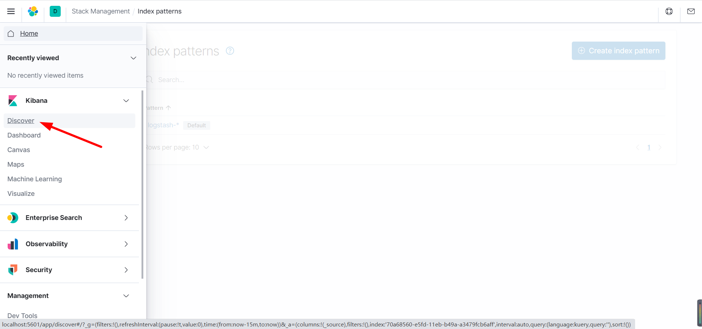
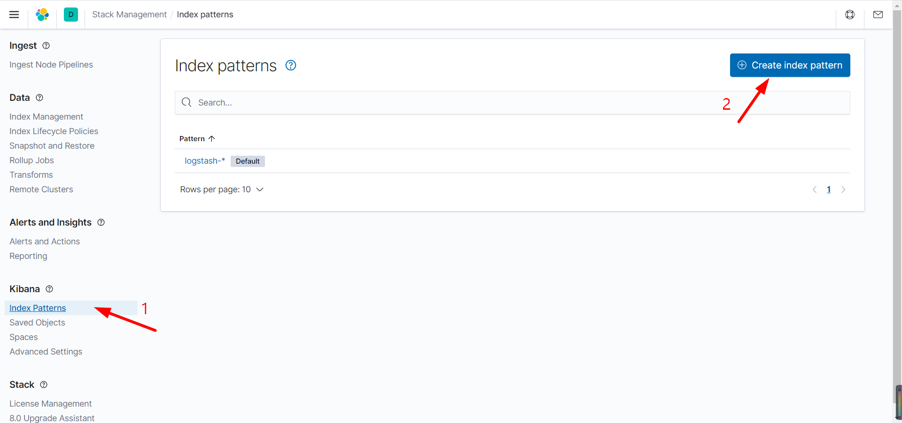
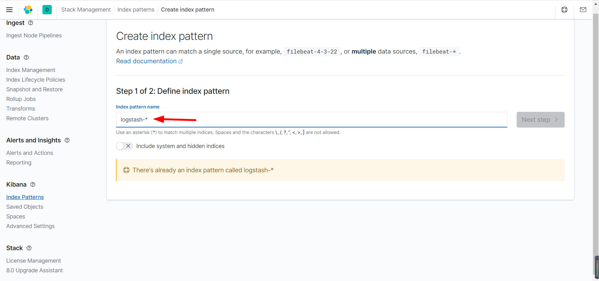
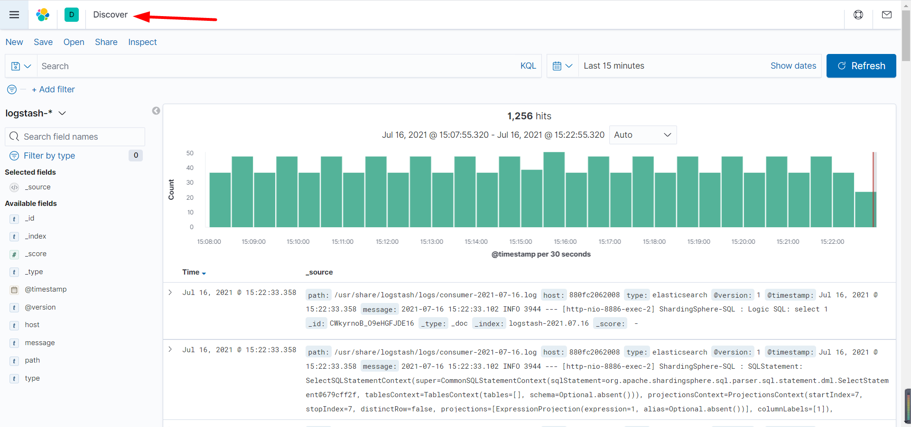

## 安装elasticsearch

* ```bash
  # 拉取镜像
  docker pull elasticsearch:6.8.11
  # 创建单独网络通信（elk + filebeat），这里主要做网络隔离，也可以使用默认网络
  docker network create esnet
  # 启动容器
  docker run -d --name elasticsearch --net esnet -p 9200:9200 -p 9300:9300 -e "discovery.type=single-node" elasticsearch:6.8.11
  ```

## 安装kibana

* ```bash
  # 拉取镜像
  docker pull kibana:6.8.11
  # 启动容器，指定 es 局域网 ip:port
  docker run --name kibana --net esnet -e ELASTICSEARCH_HOSTS=http://172.16.121.132:9200 -p 5601:5601 -d kibana:6.8.11
  ```

## 拉取logstash

* ```bash
  # 版本与elasticsearch、kibana保持一致
  docker pull logstash:6.8.11

## 创建配置文件

* ```tex
  创建文件夹保存配置文件
  D:\File\ProjectFile\Resource\elk\logstash
  D:\File\ProjectFile\Resource\elk\logstash\config
  D:\File\ProjectFile\Resource\elk\logstash\pipeline
  在config文件夹下创建logstash.yml
  在pipeline文件夹下创建logstash.conf
  ```

* logstash.yml

* ```yaml
  ## Default Logstash configuration from Logstash base image.
  ### https://github.com/elastic/logstash/blob/master/docker/data/logstash/config/logstash-full.yml
  http.host: "0.0.0.0" # 任意主机
  xpack.monitoring.elasticsearch.hosts: [ "http://172.16.121.132:9200" ] 
  # es局域网地址，ip不能写成localhost或127.0.0.1
  # elasticsearch 这里写的是你的ip
  ## X-Pack security credentials
  # xpack.monitoring.enabled: true
  # xpack.monitoring.elasticsearch.username: elastic
  # xpack.monitoring.elasticsearch.password: changeme
  ```

* logstash.conf

* ```json
  input {
    beats {
      host => "0.0.0.0" # 任意主机
      port => "4560" # 日志收集端口
    }
    file {
      path => "/usr/share/logstash/logs/*.log" # 日志收集目录，宿主机产生日志的目录映射到该目录，且必须是绝对路径
      type => "elasticsearch" # 日志类型
      start_position => "beginning" # 从文件开始处读写
    }
  }
  
  output {
    stdout { codec => rubydebug } # 输出到控制台
    elasticsearch {
      hosts => ["192.168.3.135:9200"] # es 局域网地址，ip不能写成localhost或127.0.0.1
      index => "logstash-%{+YYYY.MM.dd}" # es 索引
    }
  }
  ```

## 启动logstash

* ```bash
  docker run -it -d --name logstash --link elasticsearch --net docker_default -v D:\File\ProjectFile\Resource\elk\logstash\pipeline:/usr/share/logstash/pipeline -v D:\File\ProjectFile\Resource\elk\logstash\config\logstash.yml:/usr/share/logstash/config/logstash.yml -v D:\Work\IdeaWorkSpace\learn\fearless-admin\log:/usr/share/logstash/logs -p 4560:4560 logstash:6.8.11
  
  # --link + es容器名
  # --net es网络
  # -v 将docker容器目录挂载到宿主机目录（用宿主机目录替代docker容器的相应目录）
  ```

## springboot配置

### 引入依赖

* ```xml
  <dependency>
      <groupId>net.logstash.logback</groupId>
      <artifactId>logstash-logback-encoder</artifactId>
      <version>5.3</version>
  </dependency>
  ```

### logback-spring.xml配置appender

* ```xml
  <!--输出到elk的LOGSTASH-->
  <appender name="LOGSTASH" class="net.logstash.logback.appender.LogstashTcpSocketAppender">
      <!--LOGSTASH：ip:port-->
      <destination>192.168.3.135:4560</destination>
      <encoder charset="UTF-8" class="net.logstash.logback.encoder.LogstashEncoder">
          <providers>
              <timestamp>
                  <timeZone>UTC</timeZone>
              </timestamp>
          </providers>
      </encoder>
  </appender>
  
  <!--默认所有的包以info-->
  <root level="info">
      <appender-ref ref="LOGSTASH"/>
  </root>
  ```

## 查看索引

* ```bash
  # 安装 elasticsearch-head 插件
  # 访问
  http://localhost:9100/
  # 查看索引
  logstash-2021.07.16
  ```

## 配置kibana

* 
* 

* 

* 
