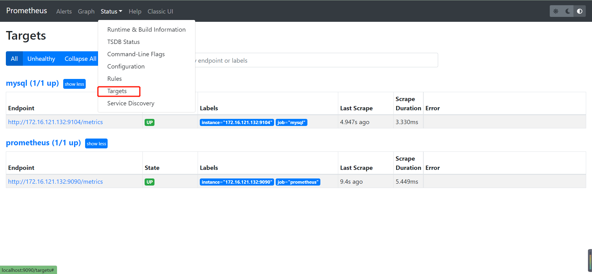
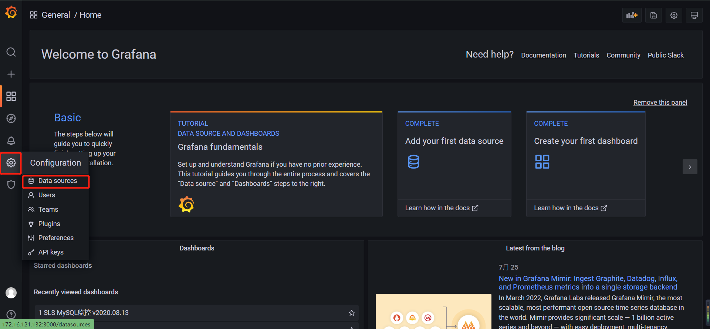
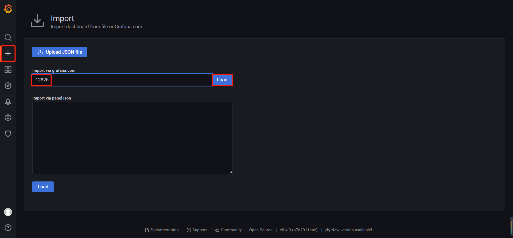
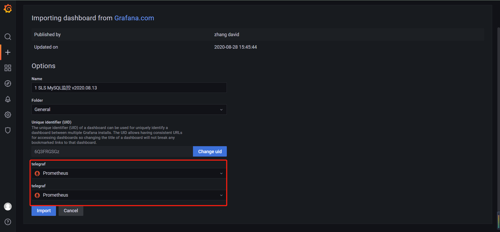
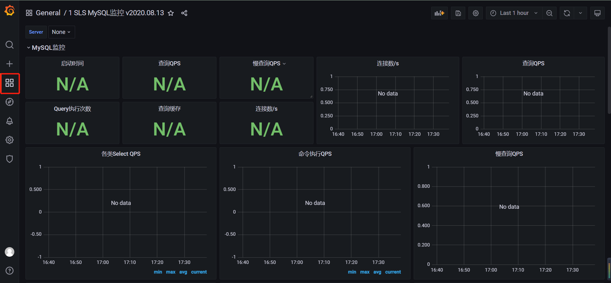

## 安装prometheus

* ```bash
  # 拉取镜像并启动容器
  docker run -d --name prometheus -p 9090:9090 prom/prometheus
  # 修改配置文件 prometheus.yml
  docker cp prometheus:/etc/prometheus/prometheus.yml D:\File\ProjectFile\Resource\prometheus\
  # 修改完复制回容器
  docker cp D:\File\ProjectFile\Resource\prometheus\prometheus.yml prometheus:/etc/prometheus/prometheus.yml
  # 重启容器
  docker restart prometheus
  # 访问地址
  http://localhost:9090/
  ```

* prometheus.yml

* ```bash
  # my global config
  global:
    scrape_interval: 15s # Set the scrape interval to every 15 seconds. Default is every 1 minute.
    evaluation_interval: 15s # Evaluate rules every 15 seconds. The default is every 1 minute.
    # scrape_timeout is set to the global default (10s).
  
  # Alertmanager configuration
  alerting:
    alertmanagers:
      - static_configs:
          - targets:
            # - alertmanager:9093
  
  # Load rules once and periodically evaluate them according to the global 'evaluation_interval'.
  rule_files:
    # - "first_rules.yml"
    # - "second_rules.yml"
  
  # A scrape configuration containing exactly one endpoint to scrape:
  # Here it's Prometheus itself.
  scrape_configs:
    # The job name is added as a label `job=<job_name>` to any timeseries scraped from this config.
    - job_name: "prometheus"
  
      # metrics_path defaults to '/metrics'
      # scheme defaults to 'http'.
  
      static_configs:
        - targets: ["172.16.121.132:9090"]
    # monitor mysql
    - job_name: "mysql"
      scrape_interval: 10s
      static_configs:
        - targets: ["172.16.121.132:9104"]  
  ```

* 

## 安装grafana

* ```bash
  # 拉取镜像并启动容器，需要加入 --link prometheus 参数，否则添加 prometheus 报错，406
  docker run -d --name=grafana --link prometheus -p 3000:3000 grafana/grafana
  # 访问地址
  http://172.16.121.132:3000/
  ```

### 配置prometheus数据源

* 

### 导入template

* 
* 

## 安装mysql-exporter

* ```bash
  # 拉取镜像并启动容器
  docker run -d --name mysql-exporter -p 9104:9104 -e DATA_SOURCE_NAME="root:root@(localhost:3306)/mysql" prom/mysqld-exporter
  # 修改 prometheus.yml，添加配置
    # monitor mysql
    - job_name: "mysql"
      scrape_interval: 10s
      static_configs:
        - targets: ["172.16.121.132:9104"] 
  ```

* 查看dashboard

* 

## 配置监控步骤

### 安装exporter

* ```bash
  # 下载地址
  https://prometheus.io/download/
  ```

### 配置prometheus.yml

* ```yaml
    # monitor mysql
    - job_name: "mysql"
      scrape_interval: 10s
      static_configs:
        - targets: ["172.16.121.132:9104"] 
  ```

### 导入模板

* ```bash
  # 模板地址
  https://grafana.com/grafana/dashboards/
  ```