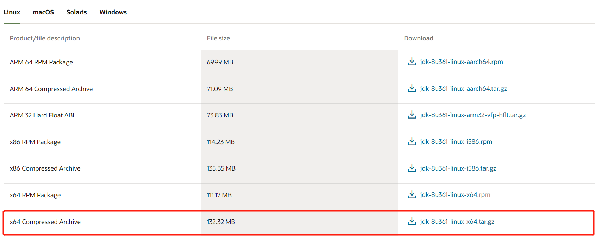

## linux安装jdk

### **查看Linux系统是否有自带的jdk**

* ```bash
  # 查看java版本
  java -version
  # 检测jdk的安装包
  rpm -qa | grep java
  # 删除包
  rpm -e --nodeps 包名
  # 检查是否删除完
  rpm -qa | grep java
  ```

### 下载jdk压缩包

* ```bash
  # 官网地址
  https://www.oracle.com/java/technologies/downloads/
  ```

* 

### 解压

* ```bash
  # 上传安装包
  scp jdk-8u361-linux-x64.tar.gz root@ip:/opt
  # 解压
  tar -zxvf jdk-8u361-linux-x64.tar.gz
  ```

### 配置环境变量

* ```bash
  # 编辑配置文件
  vim /etc/profile
  # 文件追加配置
  JAVA_HOME=/opt/jdk1.8.0_361
  PATH=/opt/jdk1.8.0_361/bin:$PATH
  export JAVA_HOME PATH
  # 刷新配置
  source /etc/profile
  # 检查安装结果
  java -version
  java
  javac
  ```

## comparator排序

* ```java
  // 排序
  Comparator<AlarmRecordTempDto> comparator = (o1, o2) -> {
      // 按时间降序
      if (!o1.getAlarmAt().isEqual(o2.getAlarmAt())) {
          return o1.getAlarmAt().isBefore(o2.getAlarmAt()) ? 1 : -1;
      } else {
          // 按最高等级升序
          if (!o1.getMaxAlarmLevel().equals(o2.getMaxAlarmLevel())) {
              return o1.getMaxAlarmLevel() - o2.getMaxAlarmLevel() > 0 ? 1 : -1;
          } else {
              // 按总告警数降序
              if (!o1.getTotalCount().equals(o2.getTotalCount())) {
                  return o1.getTotalCount() - o2.getTotalCount() < 0 ? 1 : -1;
              }
          }
      }
      return 0;
  };
  List<AlarmRecordTempDto> dtoListBySort = dtoList.stream().sorted(comparator).collect(Collectors.toList());
  ```

* ```java
  vos = vos.stream().sorted(Comparator.comparing(DataVo::getValue).reversed()).collect(Collectors.toList());
  ```

## json转换

* ```java
  JSONObject jsonObject = JSONObject.parseObject(alarmTemplate.getExtCfg());
  JSONObject uv = jsonObject.getJSONObject("undervoltageAlarm");
  String lv1 = jsonObject.getString("threshold1");
  ```

## list取子集

* ```java
  private <T> List<T> getListByCount(Integer count, List<T> list) {
      if (list.size() > count) {
          return list.subList(0, count);
      } else {
          return list;
      }
  }
  ```

## list属性映射

* ```java
  List<Long> userIds = projectUserList.stream().map(ProjectUser::getUserId).collect(Collectors.toList());
  ```

## jvm参数配置

* ```bash
  -Xms1m -Xmx1m -XX:+HeapDumpOnOutOfMemoryError -XX:+PrintGCDetails
  ```

## jdbctemplate批量插入

* ```java
  jdbcTemplate.batchUpdate(
  
      "insert into log (item_id, operate_type, operate_cause, log_type, group_id, logic_delete, created_by, created_at, updated_by, updated_at) values (?, ?, ?, ?, ?, ?, ?, ?, ?, ?);",
  
      new BatchPreparedStatementSetter() {
          @Override
          public void setValues(PreparedStatement preparedStatement, int i) throws SQLException {
              preparedStatement.setLong(1, logList.get(i).getItemId());
              preparedStatement.setInt(2, logList.get(i).getOperateType());
              preparedStatement.setString(3, logList.get(i).getOperateCause());
              preparedStatement.setInt(4, logList.get(i).getLogType());
              preparedStatement.setLong(5, logList.get(i).getGroupId());
              preparedStatement.setBoolean(6, logList.get(i).getLogicDelete());
              preparedStatement.setLong(7, logList.get(i).getCreatedBy());
              preparedStatement.setTimestamp(8, new Timestamp(logList.get(i).getCreatedAt().toInstant(ZoneOffset.of("+8")).toEpochMilli()));
              preparedStatement.setLong(9, logList.get(i).getUpdatedBy());
              preparedStatement.setTimestamp(10, new Timestamp(logList.get(i).getUpdatedAt().toInstant(ZoneOffset.of("+8")).toEpochMilli()));
          }
  
          @Override
          public int getBatchSize() {
              return logList.size();
          }
      });
  ```

## AQS 公平锁和非公平锁

* 非公平锁在调用 lock 后，首先就会调用 CAS 进行一次抢锁，如果这个时候恰巧锁没有被占用，那么直接就获取到锁返回了
* 非公平锁在 CAS 失败后，和公平锁一样都会进入到 tryAcquire 方法，在 tryAcquire 方法中，如果发现锁这个时候被释放了（state == 0），非公平锁会直接 CAS 抢锁，但是公平锁会判断等待队列是否有线程处于等待状态，如果有则不去抢锁，乖乖排到后面

## 文件操作

* ```java
  // 临时文件夹路径
  String directoryPath = System.getProperty("java.io.tmpdir");
  /**
   * 创建文件
   */
  private void createFile(String fileName, String directoryPath, byte[] result) {
      // 创建文件目录
      String filePath = directoryPath + fileName + "/";
      File directory = new File(filePath);
      if (!directory.exists()) {
          directory.mkdirs();
      }
      // byte数组转file
      byte2File(result, filePath, fileName + ".jpg");
      log.info("创建临时文件成功");
  }
  
  /**
   * byte转file
   */
  public File byte2File(byte[] buf, String filePath, String fileName) {
      BufferedOutputStream bos = null;
      FileOutputStream fos = null;
      File file = null;
      try {
          String path = StringUtils.isEmpty(filePath)? "" : filePath;
          File dir = new File(path);
          if (!dir.exists() && dir.isDirectory()) {
              dir.mkdirs();
          }
          file = new File(filePath + File.separator + fileName);
          fos = new FileOutputStream(file);
          bos = new BufferedOutputStream(fos);
          bos.write(buf);
      } catch (Exception e) {
          e.printStackTrace();
      } finally {
          if (bos != null) {
              try {
                  bos.close();
              } catch (IOException e) {
                  e.printStackTrace();
              }
          }
          if (fos != null) {
              try {
                  fos.close();
              } catch (IOException e) {
                  e.printStackTrace();
              }
          }
      }
      return file;
  }
  
  /**
   * 打包ZIP
   */
  private void packageToZip(String directoryPath, String zipFilePath) {
      // 创建一个输出流将数据写入ZIP文件
      try (FileOutputStream fos = new FileOutputStream(zipFilePath);
           ZipOutputStream zos = new ZipOutputStream(fos)) {
          // 调用递归方法压缩文件或文件夹
          addToZipFile(directoryPath, directoryPath, zos);
          log.info("文件已成功打包成 " + zipFilePath);
      } catch (IOException e) {
          log.error("文件打包异常");
      }
  }
  private void addToZipFile(String path, String sourceFile, ZipOutputStream zos) throws IOException {
      File file = new File(sourceFile);
      // 如果是文件夹，则获取其内容并递归调用此方法
      if (file.isDirectory()) {
          String[] fileList = file.list();
          if (fileList != null) {
              for (String fileName : fileList) {
                  addToZipFile(path, sourceFile + File.separator + fileName, zos);
              }
          }
          return;
      }
      // 如果是文件，则将其添加到ZIP文件中
      try (FileInputStream fis = new FileInputStream(sourceFile)) {
          String entryName = sourceFile.substring(path.length() + 1); // 获取ZIP中的条目名称
          ZipEntry zipEntry = new ZipEntry(entryName);
          zos.putNextEntry(zipEntry);
          byte[] bytes = new byte[1024];
          int length;
          while ((length = fis.read(bytes)) >= 0) {
              zos.write(bytes, 0, length);
          }
      }
  }
  
  /**
   * 下载ZIP
   */
  private void downloadZip(HttpServletResponse response, String zipFilePath) {
      // 设置响应头，告诉浏览器这是一个文件下载
      response.setContentType("application/zip");
      response.setHeader("Content-Disposition", "attachment; filename=qrCodes.zip");
      // 读取zip文件并写入响应输出流
      File zipFile = new File(zipFilePath);
      try (FileInputStream fis = new FileInputStream(zipFile);
           OutputStream os = response.getOutputStream()) {
          byte[] buffer = new byte[1024];
          int len;
          while ((len = fis.read(buffer)) != -1) {
              os.write(buffer, 0, len);
          }
      } catch (IOException e) {
          log.error("文件下载异常");
      }
  }
  
  /**
   * 删除文件
   */
  private void removeTempFile(String directoryPath, String zipFilePath) {
      // 删除zip文件
      deleteFolder(new File(zipFilePath));
      // 递归删除文件夹
      deleteFolder(new File(directoryPath));
      log.info("删除临时文件成功");
  }
  private void deleteFolder(File folder) {
      if (folder.isDirectory()) {
          File[] files = folder.listFiles();
          if (files != null) {
              for (File file : files) {
                  deleteFolder(file);
              }
          }
      }
      folder.delete();
  }
  ```
