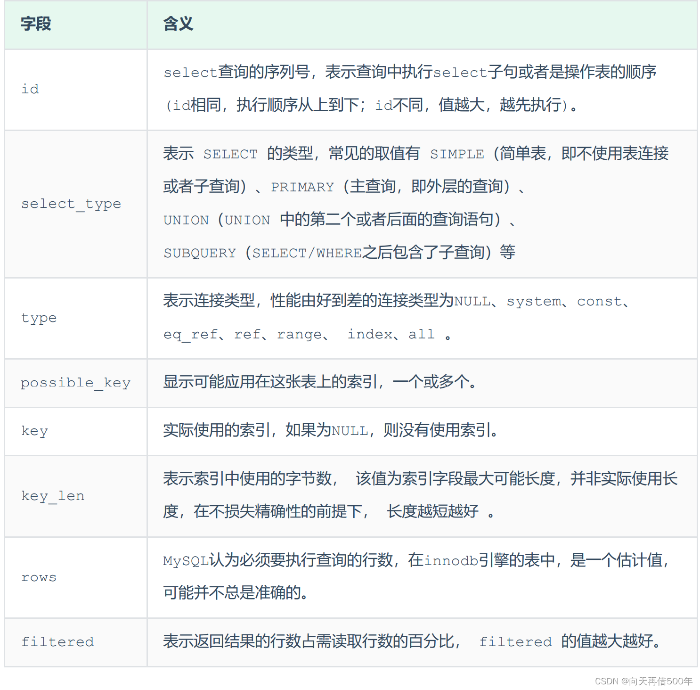

## 按年、月、日查询

* ```sql
  SELECT * FROM cms_book_statistics WHERE year(update_time ) = 2017 and month(update_time )= 09 and day(update_time ) = 27 and hour(update_time) = 12
  ```

* ```sql
  SELECT
    	DATE_FORMAT(alarm_at, '%Y-%m') months,
    	count(DISTINCT device_code) count
    FROM
    	alarm_record
    WHERE
    	logic_delete = 0
    AND group_id = 2
    AND YEAR (alarm_at) = 2020
    GROUP BY
    	months;
    
    SELECT
    	DATE_FORMAT(alarm_at, '%Y-%m-%d') days,
    	count(DISTINCT device_code) count
    FROM
    	alarm_record
    WHERE
    	logic_delete = 0
    AND group_id = 2
    AND YEAR (alarm_at) = 2020
    AND MONTH (alarm_at) = 12
    GROUP BY
    	days;
    
    SELECT
    	DATE_FORMAT(alarm_at, '%Y-%m-%d %H') hours,
    	count(DISTINCT device_code) count
    FROM
    	alarm_record
    WHERE
    	logic_delete = 0
    AND group_id = 2
    AND YEAR (alarm_at) = 2020
    AND MONTH (alarm_at) = 12
    AND DAY (alarm_at) = 31
    GROUP BY
    	hours;
  ```

## 常用命令

* ```sql
  # 查看当前数据库的INSERT、UPDATE、DELETE、SELECT的访问频次
    SHOW GLOBAL STATUS LIKE 'Com_______';
    # MySQL的慢查询日志默认没有开启
    SHOW VARIABLES LIKE 'slow_query_log';
    # 开启慢日志，在MySQL的配置文件（/etc/my.cnf）中配置
    # 开启MySQL慢日志查询开关
    slow_query_log=1
    # 设置慢日志的时间为2秒，SQL语句执行时间超过2秒，就会视为慢查询，记录慢查询日志
    long_query_time=2
    # 重启
    systemctl restart mysqld
  ```

## **explain**

* 

## 查询数据库表结构

* ```sql
  SELECT
  	COLUMN_NAME 列名,
  	COLUMN_TYPE 数据类型,
  	IS_NULLABLE 是否允许为空,
  	COLUMN_KEY 是否为主键,
  	COLUMN_COMMENT 备注 
    FROM
  	INFORMATION_SCHEMA.COLUMNS 
  	WHERE-- dj_admin为数据库名称，到时候只需要修改成你要导出表结构的数据库名称即可
  	table_schema = 'nan_music' 
  	AND -- user为表名，到时候换成你要导出的表的名称即可
    -- 如果不写的话，默认会查询出所有表中的数据，这样可能就分不清到底哪些字段
  	table_name = 'dj_admin'
    -- 这个也就是你具体查看的那个表
  ```

## 登录

* ```bash
  mysql -u root -p root
  ```

## 设置密码

* ```bash
  SET PASSWORD FOR root=PASSWORD('yourpassword');
  ```

## 创建用户授权

* ```bash
  # 创建用户
    CREATE USER 'user'@'%' IDENTIFIED BY '123456';
    # 查询权限
    SELECT * FROM mysql.user;
    SHOW GRANTS FOR 'user'@'%';
    # 授权
    GRANT ALL PRIVILEGES ON *.* TO 'user'@'%';
    # 刷新权限
    FLUSH PRIVILEGES;
    # 撤销用户权限
    REVOKE privilege ON databasename.tablename FROM 'username'@'host';
    # 删除用户
    DROP USER 'username'@'host';
    # 重启数据库
    service mysqld restart;
  ```

## 使用mysql自带工具mysqldump进行全库备份以及source命令恢复数据库

* ```bash
  # mysql数据库提供了一个很好用的工具mysqldump用以备份数据库，下面将使用mysqldump命令进行备份所有数据库以及指定数据库
    # mysqldump一次性备份所有数据库数据
    
    /usr/local/mysql/bin/mysqldump -u用户名 -p密码 --all-databases > /保存路径/文件名.sql
    
    # 注意：以上命令直接在控制台输入即可，无须登录进入数据库操作界面
    
    # 以上命令执行后，你就可以在对应路径下，找到你的备份sql文件了
    
    # mysqldump 一次性备份指定的多个数据库数据
    
    /usr/local/mysql/bin/mysqldump -u用户名 -p密码 --databases 数据库1 数据库2... > 保存路径/文件名.sql
    
    # 注意：使用以上两种方式备份的数据库，会将数据库的创建语句一起进行了备份。因此，还原时，无须先创建数据库再进行还原。有一些远程连接数据库的工具，也提供了备份的功能，但备份的sql文件中，不一定备份了数据库创建语句，因此，还原时，要保存数据库已经创建了，否则还原不了
    
    # 使用source 命令恢复数据库
    
    # 使用source 命令，需要先登录数据库，在数据库操作界面调用该指令进行还原，语法如下
    
    source 路径/文件名.sql
  ```

