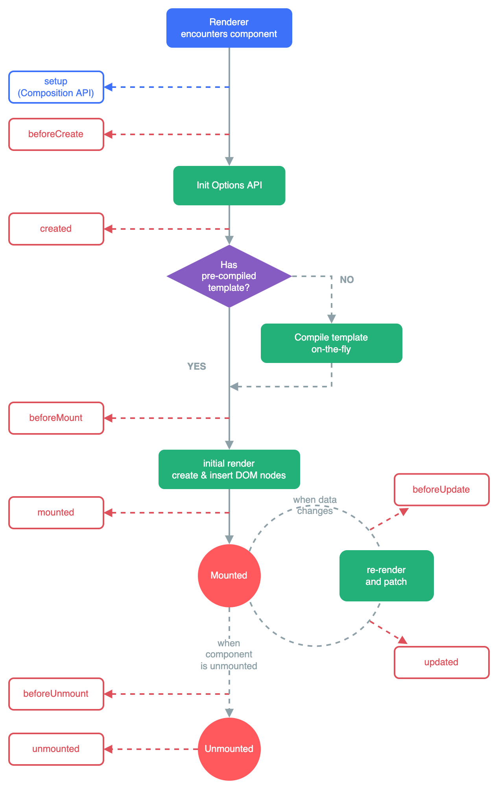

## 官方文档

* https://cn.vuejs.org/

## API风格

* 选项式API（vue2）
* 组合式API

## 创建项目

* ```bash
  # 初始化
  npm init vue@latest
  # 安装依赖
  npm install
  # 运行
  npm run dev
  ```

## 项目结构

* ```text
  your-project/
    |- public/
    |  |- index.html         # 应用程序的入口HTML文件
    |
    |- src/
    |  |- assets/            # 静态资源文件夹，如图片、样式等
    |  |- components/        # 组件文件夹
    |  |- views/             # 页面视图文件夹
    |  |- router/            # 路由配置文件夹
    |  |- store/             # Vuex状态管理文件夹
    |  |- services/          # 网络请求服务文件夹
    |  |- utils/             # 工具函数文件夹
    |  |- App.vue            # 根组件
    |  |- main.js            # 应用程序的入口文件
    |
    |- tests/                # 测试文件夹
    |
    |- .gitignore            # Git忽略文件配置
    |- babel.config.js       # Babel配置文件
    |- package.json          # 项目配置文件
    |- README.md             # 项目说明文件
  ```

## 模板语法

* `TemplateSyntax.vue`

* ```vue
  <template>
    <h3>模板语法</h3>
    <p>{{ msg }}</p>
  </template>
  <script>
    export default {
      data() {
        return {
          msg: "hello vue3"
        }
      }
    }
  </script>
  ```

## 属性绑定

* `VBind.vue`

* ```vue
  <template>
    <h3>属性绑定</h3>
    <div v-bind:id="dynamicId" :class="dynamicClass">测试</div>
    <button :disabled="isButtonDisabled">按钮</button>
    <div v-bind="attrObj"></div>
  </template>
  
  <script>
  export default {
    data() {
      return {
        dynamicClass: "dynamicClass",
        dynamicId: "dynamicId",
        isButtonDisabled: true,
        attrObj: {
          class: "dynamicClass",
          id: "dynamicId",
        },
      };
    },
  };
  </script>
  
  <style scoped>
  .dynamicClass {
    color: red;
  }
  </style>
  ```

* `v-bind`指令如果绑定的值是`null`或者`undefined`，那么改attribute将会从渲染的元素上移除

* `v-bind`简写`:`例如`v-bind:class`简写`:class`

## 条件渲染

* `VIf.vue`

* ```vue
  <template>
    <h3>条件渲染</h3>
    <div v-if="word === 'A'">A</div>
    <div v-else-if="word === 'B'">B</div>
    <div v-else>{{ word }}</div>
    <div v-show="flag">see</div>
  </template>
  
  <script>
  export default {
    data() {
      return {
        word: "D",
        flag: false,
      };
    },
  };
  </script>
  ```

* `v-if`：`v-if`指令会根据表达式的真假有条件地渲染元素。当表达式为真时，元素将被渲染；否则，元素将不会被渲染。因此，`v-if`具有“惰性”特性，即只有当条件第一次满足时，元素才会被创建和插入DOM

* `v-show`：`v-show`指令也会根据表达式的真假有条件地渲染元素。然而，无论表达式为真或假，元素始终会被创建并被插入DOM。当表达式为假时，元素将不会被显示，但它仍然存在于DOM中，并占用空间。因此，`v-show`具有“惰性”和“始终存在”的特性

## 列表渲染

* `VFor.vue`

* ```vue
  <template>
    <h3>列表渲染</h3>
    <div v-for="(i, index) in list" v-bind:key="index">{{ i }} - {{ index }}</div>
    <div v-for="(i, index) of list" :key="index">{{ i }} - {{ index }}</div>
    <div v-for="(value, key, index) in userInfo" :key="index">
      {{ key }} - {{ value }} - {{ index }}
    </div>
  </template>
  
  <script>
  export default {
    data() {
      return {
        list: ["A", "B", "C"],
        userInfo: {
          id: 1,
          name: "fearless",
          sex: "男",
        },
      };
    },
  };
  </script>
  ```

## 事件处理器

* `Event.vue`

* ```vue
  <template>
    <h3>内联事件处理器</h3>
    <button v-on:click="count++">add - {{ count }}</button>
    <h3>方法事件处理器</h3>
    <button @click="addCount">add - {{ num }}</button>
    <h3>event对象</h3>
    <button @click="addEventCount">add</button>
    <div>{{ eventNum }}</div>
    <h3>事件传参</h3>
    <p @click="getNum(item, $event)" v-for="(item, index) in nums" :key="index">
      {{ item }}
    </p>
    <h3>事件修饰符</h3>
    <a @click.prevent="clickHandler" href="https://www.baidu.com">百度一下</a>
    <div @click="clickDiv">
      <p @click.stop="clickP">点击</p>
    </div>
  </template>
  
  <script>
  export default {
    data() {
      return {
        count: 0,
        num: 0,
        eventNum: 0,
        nums: [1, 2, 3],
      };
    },
    methods: {
      addCount(e) {
        this.num++;
      },
      addEventCount(e) {
        e.target.innerHTML = "add - " + this.eventNum;
        this.eventNum++;
      },
      getNum(item, e) {
        console.log(item, e);
      },
      clickHandler(e) {
        // 阻止默认事件
        // e.preventDefault();
        console.log("点击了！");
      },
      clickDiv() {
        console.log("clickDiv");
      },
      clickP(e) {
        // 阻止事件冒泡
        // e.stopPropagation();
        console.log("clickP");
      },
    },
  };
  </script>
  ```

* `v-on:`简写`@`例如`v-on:click`简写`@click`

## 数组侦听

* `Array.vue`

* ```vue
  <template>
    <h3>数组监听</h3>
    <ul>
      <li v-for="(item, index) in nums" :key="index">
        {{ item }}
      </li>
    </ul>
    <button @click="addNum">添加数据</button>
  </template>
  
  <script>
  export default {
    data() {
      return {
        nums: [1, 2, 3, 4, 5],
      };
    },
    methods: {
      addNum() {
        // 变更方法：引起UI自动更新
        this.nums.push(6);
        // 替换一个数组：不会引起UI自动更新
        // this.nums = this.nums.concat(7);
      },
    },
  };
  </script>
  ```

## 计算属性

* `Computed.vue`

* ```vue
  <template>
    <h3>计算属性</h3>
    <p>{{ userInfo.name }}</p>
    <p>{{ getNum }}</p>
    <p>{{ getNums() }}</p>
  </template>
  
  <script>
  export default {
    data() {
      return {
        userInfo: {
          name: "fearless",
          nums: [1, 2, 3],
        },
      };
    },
    computed: {
      getNum() {
        return this.userInfo.nums.length > 0 ? "yes" : "no";
      },
    },
    methods: {
      getNums() {
        return this.userInfo.nums.length > 0 ? "yes" : "no";
      },
    },
  };
  </script>
  ```

* 计算属性：计算属性值会基于其响应式依赖被缓存，一个计算属性仅会在其响应式依赖更新时才会重新计算

* 方法：方法调用总是会在重新渲染发生时再次执行函数

## class绑定

* `ClassBind.vue`

* ```vue
  <template>
    <h3>class绑定</h3>
    <p :class="{ active: isActive, 'text-danger': isDanger }">class</p>
    <p :class="myClass">class</p>
    <p :class="[arrActive, arrDanger]">class</p>
    <p :class="[isActive ? 'active text-danger' : '']">class</p>
    <p :class="[isActive ? 'active' : '', { 'text-danger': isDanger }]">class</p>
  </template>
  
  <script>
  export default {
    data() {
      return {
        isActive: true,
        isDanger: true,
        myClass: {
          active: true,
          "text-danger": true,
        },
        arrActive: "active",
        arrDanger: "text-danger",
      };
    },
  };
  </script>
  
  <style>
  .active {
    font-size: 30px;
  }
  .text-danger {
    color: red;
  }
  </style>
  ```

* 数组和对象嵌套时，只能数组嵌套对象

## style绑定

* `StyleBind.vue`

* ```vue
  <template>
    <h3>style绑定</h3>
    <p :style="{ color: activeColor, fontSize: activeFont + 'px' }">style</p>
    <p :style="myStyle">style</p>
    <p :style="[myStyle]">style</p>
  </template>
  
  <script>
  export default {
    data() {
      return {
        activeColor: "green",
        activeFont: 30,
        myStyle: {
          color: "green",
          fontSize: "30px",
        },
      };
    },
  };
  </script>
  ```

## 侦听器

* `Watch.vue`

* ```vue
  <template>
    <h3>侦听器</h3>
    <p>{{ msg }}</p>
    <button @click="update">修改数据</button>
  </template>
  
  <script>
  export default {
    data() {
      return {
        msg: "hello",
      };
    },
    methods: {
      update() {
        this.msg = "world";
      },
    },
    watch: {
      // 函数名必须与侦听的数据对象保持一致
      // 数据发生变化，自动执行的函数
      msg(newValue, oldValue) {
        console.log(newValue, oldValue);
      },
    },
  };
  </script>
  ```

* 侦听器函数名必须与侦听的数据对象保持一致

## 表单数据绑定

* ```vue
  <template>
    <h3>表单输入绑定</h3>
    <input type="text" v-model.lazy="message" />
    <p>{{ message }}</p>
    <input type="checkbox" v-model="checked" />
    <label for="checkbox">{{ checked }}</label>
  </template>
  
  <script>
  export default {
    data() {
      return {
        message: "",
        checked: false,
      };
    },
  };
  </script>
  ```

## 模板引用

* `Ref.vue`

* ```vue
  <template>
    <h3>模板引用</h3>
    <div ref="container" class="container">{{ content }}</div>
    <button @click="getElement">元素</button>
    <input type="text" ref="username" />
    <button @click="getValue">获取输入</button>
    <p>{{ username }}</p>
  </template>
  
  <script>
  /**
   * 修改文本：{{ 模板语法 }}
   * 修改属性：v-bind:class指令
   * 修改事件：v-on:click指令
   */
  export default {
    data() {
      return {
        content: "容器",
        username: "",
      };
    },
    methods: {
      getElement() {
        this.$refs.container.innerHTML = "修改元素";
      },
      getValue() {
        this.username = this.$refs.username.value;
      },
    },
  };
  </script>
  ```

## 组件注册

* 全局注册

* `main.js`

* ```js
  import { createApp } from 'vue'
  import App from './App.vue'
  import Header from './pages/Header.vue'
  
  // app：Vue的实例对象
  // 在Vue项目中，有且只有一个Vue的实例对象
  // App：根组件
  const app = createApp(App)
  
  // 全局注册：在这中间写组件的注册
  // app.component("Header", Header)
  // 全局数据传递
  app.provide("globalData", "全局数据")
  // 挂载应用
  app.mount('#app')
  ```
  
* ```vue
  <template>
    <h3>hello vue3</h3>
    <Header/>
  </template>
  ```

* 局部注册

* `App.vue`

* ```vue
  <template>
    <h3>hello vue3</h3>
    <!-- 3.显示组件 -->
    <!-- <TemplateSyntax/> -->
    <!-- <VBind/> -->
    <!-- <VIf/> -->
    <!-- <VFor/> -->
    <!-- <Event/> -->
    <!-- <Array/> -->
    <!-- <Computed/> -->
    <!-- <ClassBind/> -->
    <!-- <StyleBind/> -->
    <!-- <Watch/> -->
    <!-- <VModel/> -->
    <!-- <Ref/> -->
    <!-- <VComponent/> -->
    <!-- <Header/> -->
    <!-- <Main/> -->
    <!-- <Aside/> -->
    <!-- <ParentProps/> -->
    <!-- <ParentEmit/> -->
    <!-- <ParentAttr/> -->
    <!-- <ParentSlot/> -->
    <!-- <ComponentLife/> -->
    <!-- <ComponentLifeApply/> -->
    <!-- <ComponentC/> -->
    <GrandParentProps />
  </template>
  
  <script>
  // 1.引入组件
  import TemplateSyntax from "./components/TemplateSyntax.vue";
  import VBind from "./components/VBind.vue";
  import VIf from "./components/VIf.vue";
  import VFor from "./components/VFor.vue";
  import Event from "./components/Event.vue";
  import Array from "./components/Array.vue";
  import Computed from "./components/Computed.vue";
  import ClassBind from "./components/ClassBind.vue";
  import StyleBind from "./components/StyleBind.vue";
  import Watch from "./components/Watch.vue";
  import VModel from "./components/VModel.vue";
  import Ref from "./components/Ref.vue";
  import VComponent from "./components/VComponent.vue";
  import Header from "./pages/Header.vue";
  import Main from "./pages/Main.vue";
  import Aside from "./pages/Aside.vue";
  import ParentProps from "./components/ParentProps.vue";
  import ParentEmit from "./components/ParentEmit.vue";
  import ParentAttr from "./components/ParentAttr.vue";
  import ParentSlot from "./components/ParentSlot.vue";
  import ComponentLife from "./components/ComponentLife.vue";
  import ComponentLifeApply from "./components/ComponentLifeApply.vue";
  import ComponentC from "./components/ComponentC.vue";
  import GrandParentProps from "./components/GrandParentProps.vue";
  export default {
    // 2.注入组件
    components: {
      TemplateSyntax,
      VBind,
      VIf,
      VFor,
      Event,
      Array,
      Computed,
      ClassBind,
      StyleBind,
      Watch,
      VModel,
      Ref,
      VComponent,
      Header,
      Main,
      Aside,
      ParentProps,
      ParentEmit,
      ParentAttr,
      ParentSlot,
      ComponentLife,
      ComponentLifeApply,
      ComponentC,
      GrandParentProps,
    },
  };
  </script>
  ```

## 组件间传递数据—props

* `main.js`

* ```js
  import { createApp } from 'vue'
  import App from './App.vue'
  import Header from './pages/Header.vue'
  
  // app：Vue的实例对象
  // 在Vue项目中，有且只有一个Vue的实例对象
  // App：根组件
  const app = createApp(App)
  
  // 全局注册：在这中间写组件的注册
  // app.component("Header", Header)
  // 全局数据传递
  app.provide("globalData", "全局数据")
  // 挂载应用
  app.mount('#app')
  ```

* `GrandParentProps.vue`

* ```vue
  <template>
    <h3>GrandParent</h3>
    <ParentProps />
  </template>
  
  <script>
  import ParentProps from "./ParentProps.vue";
  export default {
    data() {
      return {
        message: "GrandParent to Child",
      };
    },
    // provide:{
    //     grandParentMessage:"GrandParent to Child"
    // },
    provide() {
      return { grandParentMessage: this.message };
    },
    components: {
      ParentProps,
    },
  };
  </script>
  ```

* `ParentProps.vue`

* ```vue
  <template>
    <h3>Parent</h3>
    <ChildProps :title="titleMsg" :age="age" :info="info" :onEvent="dataFn" />
    <p>父元素：{{ message }}</p>
  </template>
  
  <script>
  import ChildProps from "./ChildProps.vue";
  export default {
    data() {
      return {
        titleMsg: "A",
        age: 20,
        info: {
          key: "key",
          value: "value",
        },
        message: "",
      };
    },
    components: {
      ChildProps,
    },
    methods: {
      dataFn(data) {
        this.message = data;
      },
    },
  };
  </script>
  ```

* `ChildProps.vue`

* ```vue
  <template>
    <h3>Child</h3>
    <p>{{ title }} - {{ name }}</p>
    <ul>
      <li v-for="(item, index) in nums" :key="index">{{ item }}</li>
    </ul>
    <p>{{ info.key }}</p>
    <p>{{ info.value }}</p>
    <p>{{ onEvent("传递数据") }}</p>
    <p>{{ grandParentMessage }}</p>
    <p>{{ fullMessage }}</p>
    <P>{{ globalData }}</P>
  </template>
  
  <script>
  export default {
    props: {
      title: {
        type: String,
      },
      name: {
        type: [String, Number],
        default: "C",
      },
      age: {
        type: Number,
        required: true,
      },
      // 数字和字符串可以直接default，如果是数组和对象，必须通过工厂函数返回默认值
      nums: {
        type: Array,
        default() {
          return [1, 2, 3];
        },
      },
      info: {
        type: Object,
      },
      onEvent: {
        type: Function,
      },
    },
    inject: ["grandParentMessage", "globalData"],
    data() {
      return {
        fullMessage: this.grandParentMessage,
      };
    },
  };
  </script>
  ```
  
* props：传递数据只能父组件传递到子组件

* props：传递的数据是只读的，不允许修改

* provide和inject：传递数据只能自上往下传递

## 组件事件

* `ParentEmit.vue`

* ```vue
  <template>
    <h3>Parent</h3>
    <ChildEmit @someEvent="getHandle" @searchEvent="searchHandle" />
    <p>{{ message }}</p>
    <p>搜索内容：{{ searchMsg }}</p>
  </template>
    
  <script>
  import ChildEmit from "./ChildEmit.vue";
  export default {
    data() {
      return {
        message: "",
        searchMsg: "",
      };
    },
    components: {
      ChildEmit,
    },
    methods: {
      getHandle(childMsg) {
        this.message = childMsg;
      },
      searchHandle(data) {
        this.searchMsg = data;
      },
    },
  };
  </script>
  ```

* `ChildEmit.vue`

* ```vue
  <template>
    <h3>Child</h3>
    <button @click="sendHandle">传递数据：子->父</button>
    搜索：<input type="text" v-model="search" />
  </template>
    
  <script>
  export default {
    emits: ["someEvent", "searchEvent"],
    data() {
      return {
        msg: "child message",
        search: "",
      };
    },
    methods: {
      sendHandle() {
        // 自定义事件
        this.$emit("someEvent", this.msg);
      },
    },
    watch: {
      search(newValue, oldValue) {
        this.$emit("searchEvent", newValue);
      },
    },
  };
  </script>
  ```

* 父传子：`props`

* 子传父：自定义事件（`this.$emit`)，`props`函数间接传递

## 透传Attributes

* `ParentAttr.vue`

* ```vue
  <template>
    <h3>父属性</h3>
    <ChildAttr class="attr-container" />
  </template>
  
  <script>
  import ChildAttr from "./ChildAttr.vue";
  export default {
    components: {
      ChildAttr,
    },
  };
  </script>
  ```

* `ChildAttr.vue`

* ```vue
  <template>
    <!-- 必须是唯一根属性 -->
    <h3>子属性</h3>
  </template>
  
  <script>
  export default {
    // 禁用属性透传
    inheritAttrs: false,
  };
  </script>
  
  <style scoped>
  .attr-container {
    color: red;
  }
  </style>
  ```

## 插槽Slots

* `ParentSlot.vue`

* ```vue
  <template>
    <ChildSlot>
      <template v-slot:title>
        <h3>插槽标题</h3>
      </template>
      <template #content="slotProps">
        <p>{{ message }} - {{ slotProps.msg }}</p>
      </template>
    </ChildSlot>
  </template>
  
  <script>
  import ChildSlot from "./ChildSlot.vue";
  export default {
    data() {
      return {
        message: "插槽内容",
      };
    },
    components: {
      ChildSlot,
    },
  };
  </script>
  ```

* `ChildSlot.vue`

* ```vue
  <template>
    <h3>插槽基础知识</h3>
    <slot name="title">插槽默认值</slot>
    <slot name="content" :msg="childMessage">插槽默认值</slot>
  </template>
  
  <script>
  export default {
    data() {
      return {
        childMessage: "子组件数据",
      };
    },
  };
  </script>
  ```

## 组件生命周期

* 
* `ComponentLife.vue`
* ```vue
  <template>
    <h3>组件的生命周期</h3>
    <p>{{ msg }}</p>
    <button @click="update">修改数据</button>
  </template>
  
  <script>
  /**
   * 生命周期函数
   *  创建期：beforeCreate created
   *  挂载期：beforeMount mounted
   *  更新期：beforeUpdate updated
   *  销毁期：beforeUnmount unmounted
   */
  export default {
    data() {
      return {
        msg: "A",
      };
    },
    methods: {
      update() {
        this.msg = "B";
      },
    },
    beforeCreate() {
      console.log("组件创建之前");
    },
    created() {
      console.log("组件创建之后");
    },
    beforeMount() {
      console.log("组件渲染之前");
    },
    mounted() {
      console.log("组件渲染之后");
    },
    beforeUpdate() {
      console.log("组件更新之前");
    },
    updated() {
      console.log("组件更新之后");
    },
    beforeUnmount() {
      console.log("组件销毁之前");
    },
    unmounted() {
      console.log("组件销毁之后");
    },
  };
  </script>
  ```

## 组件生命周期应用

* `ComponentLifeApply.vue`

* ```vue
  <template>
    <h3 ref="name">组件的生命周期应用</h3>
    <ul>
      <li v-for="item in items" :key="item.id">
        <p>{{ item.id }}</p>
        <p>{{ item.age }}</p>
        <p>{{ item.name }}</p>
        <p>{{ item.score }}</p>
      </li>
    </ul>
  </template>
  
  <script>
  /**
   * 生命周期函数
   *  创建期：beforeCreate created
   *  挂载期：beforeMount mounted
   *  更新期：beforeUpdate updated
   *  销毁期：beforeUnmount unmounted
   */
  export default {
    data() {
      return {
        items: [],
      };
    },
    beforeMount() {
      console.log(this.$refs.name); // undefined
    },
    mounted() {
      // 获取元素DOM结构
      console.log(this.$refs.name);
      // 模拟网络请求
      this.items = [
        { age: 18, id: 1, name: "张三", score: 88.0 },
        { age: 20, id: 2, name: "李四", score: 90.0 },
      ];
    },
  };
  </script>
  ```

## 动态组件

* `ComponentC.vue`

* ```vue
  <template>
    <h3>ComponentC</h3>
    <component :is="tabComponent"></component>
    <button @click="changeHandle">切换组件</button>
  </template>
  
  <script>
  import ComponentA from "./ComponentA.vue";
  import ComponentB from "./ComponentB.vue";
  export default {
    data() {
      return {
        tabComponent: "ComponentA",
      };
    },
    components: {
      ComponentA,
      ComponentB,
    },
    methods: {
      changeHandle() {
        this.tabComponent =
          this.tabComponent == "ComponentA" ? "ComponentB" : "ComponentA";
      },
    },
  };
  </script>
  ```

* `ComponentA.vue`

* ```vue
  <template>
      <h3>ComponentA</h3>
  </template>
  ```

* `ComponentB.vue`

* ```vue
  <template>
      <h3>ComponentB</h3>
  </template>
  ```


## Vue应用

* `main.js`

* ```js
  import { createApp } from 'vue'
  import App from './App.vue'
  import Header from './pages/Header.vue'
  
  // app：Vue的实例对象
  // 在Vue项目中，有且只有一个Vue的实例对象
  // App：根组件
  const app = createApp(App)
  
  // 全局注册：在这中间写组件的注册
  // app.component("Header", Header)
  // 全局数据传递
  app.provide("globalData", "全局数据")
  // 挂载应用
  app.mount('#app')
  ```

* assets文件夹：存放公共静态资源
